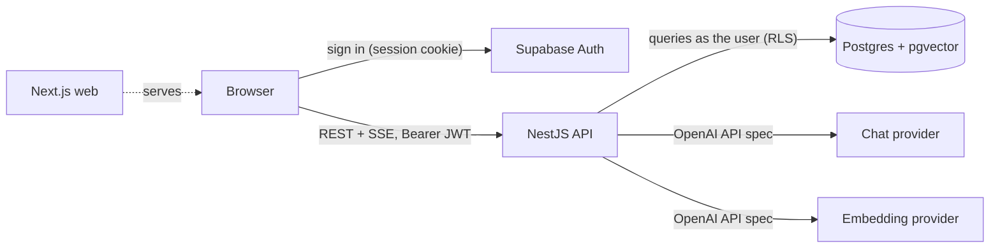

# AI Knowledge Base

Write or upload documents, then ask questions about them. Answers are grounded in your own documents,
stream in as they are generated, and cite the passages they came from.

Turborepo · Next.js 16 · NestJS 12 · Supabase (Postgres, pgvector, Auth, RLS) · any OpenAI-compatible AI provider

---

## Quick start

Prerequisites: **Node.js 22+**, **pnpm 10**, **Docker** (running).

```bash
git clone <this repo> && cd <repo>
pnpm bootstrap   # install, start Supabase, apply migrations, write .env
```

Then add an AI key to `.env` (the defaults use free OpenRouter models, so a free key from
<https://openrouter.ai/keys> is enough; paste it into `AI_CHAT_API_KEY` and `AI_EMBED_API_KEY`) and run:

```bash
pnpm dev
```

| What            | Where                  |
| --------------- | ---------------------- |
| Web app         | http://localhost:3000  |
| API             | http://localhost:4000  |
| Supabase Studio | http://127.0.0.1:54323 |

Sign up with any email (confirmation is off locally), upload the files in [`samples/`](samples), and ask
something like _"How many vacation days do I get and do they carry over?"_.

`pnpm bootstrap` is idempotent: re-running it keeps your `.env` values and only applies missing migrations.

### Other commands

| Command          | Does                                                                        |
| ---------------- | --------------------------------------------------------------------------- |
| `pnpm build`     | Builds every workspace (Turborepo, cached)                                  |
| `pnpm lint`      | Type-aware ESLint across the monorepo                                       |
| `pnpm typecheck` | `tsc --noEmit` everywhere                                                   |
| `pnpm test`      | Unit tests (chunker, AI adapters, SSE codec, citations)                     |
| `pnpm test:e2e`  | Full RAG flow against the real database and a fake AI provider, **no keys** |
| `pnpm db:reset`  | Recreates the local database from `supabase/migrations`                     |
| `pnpm db:types`  | Regenerates TypeScript types from the database schema                       |
| `pnpm db:stop`   | Stops the Supabase containers                                               |

---

## Architecture



```
apps/
  web/                 Next.js 16 (App Router): auth, documents, chat, usage
  api/                 NestJS 12 (ESM)
    src/ai/            ChatModel / EmbeddingModel interfaces + the OpenAI-compatible adapter
    src/auth/          global guard: verifies the Supabase JWT, builds a per-user DB client
    src/documents/     CRUD, file upload (PDF/TXT/MD), re-indexing
    src/ingestion/     chunker + chunk → embed → store
    src/retrieval/     hybrid search
    src/chat/          conversations, prompts, citations, SSE streaming
    src/usage/         token accounting
packages/
  shared/              API contract: zod schemas + types, SSE codec (used by web and api)
  typescript-config/   base / nestjs / nextjs / library tsconfigs
  eslint-config/       type-aware rules shared by every workspace
supabase/
  migrations/          schema, RLS, SQL functions
scripts/bootstrap.mjs  one-command setup
```

### How a question is answered

1. The question is saved. For a follow-up, the chat model first rewrites it into a standalone query
   ("and who can read them?" → "who can read Supabase embeddings"), because retrieval sees one string,
   not the conversation.
2. The query is embedded and `match_chunks` runs a **hybrid search**: pgvector cosine distance and
   Postgres full-text search, merged with Reciprocal Rank Fusion.
3. The top chunks go into the prompt as numbered sources. The model must answer only from them, cite
   them as `[n]`, and say so when the answer is not there.
4. The answer streams to the browser over SSE (`sources` → `delta`… → `done`). On completion it is saved
   with its sources, each flagged by whether the answer actually cited it.

---

## Architecture decisions and why

**One contract, one place.** Request schemas live in `packages/shared` as zod schemas. The API validates
with them (a small `ZodValidationPipe` instead of class-validator), and the web app is typed by them,
so the two sides cannot drift.

**RLS is the security boundary, not the API.** Every table has owner-only Row Level Security. The API
never uses the service-role key: the auth guard verifies the user's JWT and creates a Supabase client
that sends that JWT, so every query, including the vector search function (`security invoker`), runs as
the user. A bug in a service cannot leak another user's documents; the end-to-end test checks this with
two users. The guard still rejects unauthenticated calls early, before any AI tokens are spent.

**A provider-agnostic AI layer with two interfaces.** `ChatModel` (`complete`, `stream`) and
`EmbeddingModel` (`embedDocuments`, `embedQuery`) are all the application knows about. They are separate
because providers are not symmetric: Groq has no embeddings; OpenRouter's free router works for chat but
not for embeddings. `embedQuery` and `embedDocuments` are separate because asymmetric models (E5, nomic,
LFM2.5) are trained with different prefixes for queries and passages. One adapter implements both over
the OpenAI SDK with a configurable `baseURL`; provider "presets" only fill in a default URL. The adapter
sends only what the spec guarantees (optional parameters such as `temperature` only when configured,
`encoding_format: "float"` because not every server implements base64) and validates what comes back
(vector size, row order by `index`). Swapping providers is a `.env` edit; see below.

**Embeddings are pinned and labelled.** Vectors from different models live in different spaces even when
they have the same length, so every chunk stores the model that produced it and search only compares
vectors from the configured model. After a model change, documents show as `stale` until re-indexed. The
column is `vector(1024)`: bge-m3, bge-large, mxbai-embed-large and LFM2.5 produce 1024 natively and
OpenAI `text-embedding-3-*` via `dimensions`. A mismatch fails loudly with a message naming the setting.

**Chunking.** Markdown-aware and recursive: headings split sections (a chunk never crosses a heading, the
author already drew a topical boundary there), then paragraphs with code blocks kept whole, then
sentences, then word windows. Chunks are at most ~350 tokens with ~15% overlap, for three reasons:

- the smallest-context embedding models supported (BGE, E5, LFM2.5) accept 512 tokens, and the chunk
  must fit with its title/heading prefix;
- paragraph-sized chunks retrieve precisely while still carrying enough context to answer from;
- overlap keeps a fact that straddles a boundary whole in at least one chunk.

Tokens are estimated at ~4 characters per token instead of using a tokenizer: the API doesn't know which
model sits behind a base URL, and a conservative estimate beats a precise but wrong one. Each chunk is
embedded as `title › heading path` + text, so a chunk that says "it supports SSO" still knows what "it" is.

**Hybrid retrieval with RRF.** Embeddings catch paraphrases; full-text search catches exact terms that
embeddings blur (names, error codes, `SEV1`). Reciprocal Rank Fusion merges the two rankings using only
ranks, so their incomparable score scales never need calibrating. It all runs in one SQL function next to
the data. The HNSW index uses pgvector's iterative scans, so RLS filtering can't silently return fewer
rows than asked for.

**Indexing is synchronous but decoupled by status.** The document is saved first; indexing only moves
`index_status` (`pending → indexing → ready | failed`), so a provider outage never loses text and the UI
shows the error with a retry button. Indexing is idempotent through a generated `content_hash`
(tag-only edits don't re-embed), and `replace_document_chunks` swaps chunks atomically and refuses to
apply a result for text that changed meanwhile, so a slow run can't overwrite a newer one. Moving it to a
durable queue would change the transport, not the design.

**Streaming over SSE on a POST.** `EventSource` can't send a body, so the client reads the stream with
`fetch` and a small SSE parser from `packages/shared` (unit-tested for chunk boundaries and CRLF). Closing
the tab aborts the provider request, so nobody pays for tokens no one will read.

**Frontend.** TanStack Query owns server state (cache keys in one file, invalidation after mutations,
retries only for server errors). Forms reset from the server copy by re-keying on `updatedAt` rather than
syncing with effects. The browser talks to Supabase only for auth; `proxy.ts` (Next 16's middleware)
refreshes the session cookie and redirects signed-out users, while real enforcement stays in the API and RLS.

**Monorepo and DX.** Turborepo pipelines (`build`, `dev`, `lint`, `typecheck`, `test`, `test:e2e`) with
`^build` dependencies so the shared package is always compiled first. One root `.env` feeds both apps
(real environment variables take precedence). TypeScript is pinned to 6.0 because typescript-eslint and
the Nest CLI don't support 7 yet.

---

## Swapping AI providers

Everything is in `.env`; no code changes. Chat and embeddings are configured independently:

```dotenv
AI_CHAT_PROVIDER=openrouter        # openai | groq | together | openrouter | ollama | custom
AI_CHAT_BASE_URL=                  # optional override; required for custom
AI_CHAT_API_KEY=...
AI_CHAT_MODEL=openrouter/free

AI_EMBED_PROVIDER=openrouter
AI_EMBED_API_KEY=...
AI_EMBED_MODEL=liquid/lfm-2.5-embedding-350m:free
AI_EMBED_DIMENSIONS=1024           # must match the vector(1024) column
AI_EMBED_QUERY_PREFIX="query: "
AI_EMBED_DOCUMENT_PREFIX="document: "
```

| Provider               | Chat example                                                                              | Embeddings example                                            |
| ---------------------- | ----------------------------------------------------------------------------------------- | ------------------------------------------------------------- |
| OpenAI                 | `gpt-4o-mini`                                                                             | `text-embedding-3-small` + `AI_EMBED_SEND_DIMENSIONS=true`    |
| OpenRouter (free)      | `openrouter/free`                                                                         | `liquid/lfm-2.5-embedding-350m:free` + `query: `/`document: ` |
| Groq                   | `llama-3.3-70b-versatile`                                                                 | none, use another provider for embeddings                     |
| Together AI            | `meta-llama/Llama-3.3-70B-Instruct-Turbo`                                                 | `BAAI/bge-large-en-v1.5`                                      |
| Ollama (local, no key) | `llama3.2`                                                                                | `mxbai-embed-large` (query prefix in `.env.example`)          |
| Anything else          | `AI_CHAT_PROVIDER=custom` + `AI_CHAT_BASE_URL=…/v1` (LiteLLM, vLLM, LM Studio, a gateway) | same                                                          |

After changing the **chat** model, restart the API; nothing else is needed. After changing the
**embedding** model, restart the API and click **Re-index outdated** on the Documents page (or
`POST /documents/reindex`): existing chunks are marked `stale` and are not searched until re-embedded
with the new model. The sidebar shows which provider and model are active.

---

## Database

| Table / function              | Purpose                                                                             |
| ----------------------------- | ----------------------------------------------------------------------------------- |
| `documents`                   | Source of truth: title, content, tags, `content_hash`, indexing status              |
| `document_chunks`             | Chunk text, heading path, `vector(1024)` (HNSW, cosine), generated `tsvector` (GIN) |
| `conversations`, `messages`   | Persistent chat history; assistant messages keep citations and the retrieval query  |
| `usage_events`, `usage_daily` | One row per provider call; the view aggregates per day, operation and model         |
| `match_chunks()`              | Hybrid search with RRF, `security invoker` so RLS applies                           |
| `replace_document_chunks()`   | Atomic, stale-safe chunk replacement                                                |

Migrations live in `supabase/migrations` and are applied by `pnpm bootstrap` / `pnpm db:reset` locally
and by `supabase db push` for a hosted project. Enums (`index_status`, `message_role`, `usage_kind`)
become union types in the generated `database.types.ts`, so the API is type-checked against the schema.

---

## Testing

- **Unit** (`pnpm test`): the chunker; the AI adapter against a fake OpenAI-compatible HTTP server
  (request shape, streaming, batching, prefixes, `dimensions`, dimension mismatch, errors, routers);
  provider configuration; the SSE parser; citation marking.
- **End-to-end** (`pnpm test:e2e`, needs `pnpm db:start`): the built API against the local Supabase and a
  fake provider whose embeddings are bag-of-words hashes, so retrieval results are meaningful without any
  API key. Covers auth, validation, indexing, RLS isolation between two users, hash-guarded re-indexing,
  retrieval of the right section, SSE streaming, citations, history and usage.

---

## API

All routes except `/health` and `/ai/meta` need `Authorization: Bearer <Supabase access token>`.
Errors are always `{ "error": { "code", "message", "details?" } }`.

| Method | Route                         | Description                                  |
| ------ | ----------------------------- | -------------------------------------------- |
| GET    | `/documents?search=&tag=`     | List documents                               |
| POST   | `/documents`                  | Create and index a document                  |
| POST   | `/documents/upload`           | Create from a PDF, TXT or Markdown file      |
| GET    | `/documents/:id`              | Document with indexing details               |
| PATCH  | `/documents/:id`              | Update; re-indexes only if the text changed  |
| DELETE | `/documents/:id`              | Delete (chunks cascade)                      |
| POST   | `/documents/:id/reindex`      | Force re-indexing                            |
| POST   | `/documents/reindex`          | Re-index everything pending, failed or stale |
| GET    | `/conversations`              | List conversations                           |
| POST   | `/conversations`              | Create a conversation                        |
| GET    | `/conversations/:id`          | Conversation with messages                   |
| PATCH  | `/conversations/:id`          | Rename                                       |
| DELETE | `/conversations/:id`          | Delete                                       |
| POST   | `/conversations/:id/messages` | Ask a question; responds with an SSE stream  |
| GET    | `/usage?days=30`              | Token usage per day, operation and model     |
| GET    | `/ai/meta`                    | Active providers and models (no secrets)     |

---

## What I would improve with more time

- **Durable ingestion.** Move indexing to a queue (pg-boss or Inngest) with progress in the UI, so large
  PDFs don't hold a request open; re-embed only the chunks whose hash changed.
- **Retrieval quality, measured.** A small evaluation set (questions with expected chunks) to tune chunk
  size, overlap and the RRF constant by recall@k instead of by judgement; then a reranker and a similarity
  floor calibrated per embedding model.
- **Resilience and cost control.** Per-user rate limiting (Redis), a fallback chain of chat providers for
  429s, a semantic cache for repeated questions, and budget alerts on top of the usage table.
- **Real tokenization.** A tokenizer registry keyed by model for exact chunk sizes where the model is known.
- **Multilingual search.** The full-text configuration is `english`; per-document language detection
  would pick the right one, alongside a multilingual embedding model such as bge-m3.
- **Collaboration.** Workspaces with shared documents and roles, which RLS policies can express directly.
- **Operations.** Dockerfiles, CI running lint, tests and the e2e suite against `supabase start`, and
  OpenTelemetry traces across retrieval and generation.

---

## How AI was used

Built with Claude Code as a pair programmer; it wrote most of the code. The workflow:

- **Requirements as a checklist.** The brief became a list of requirements, and each one was checked
  against the running system rather than against code that looks right.
- **Tight feedback loop.** Every change went through lint, typecheck, unit tests and the e2e suite, which
  runs the built API against a real local Supabase and a fake OpenAI-compatible server.
- **Real models found what tests didn't.** Using the app with free OpenRouter models surfaced issues that
  were then fixed and covered: a router model answering an English question in Korean (the answer rules
  are now restated right after the question), a pinned free model returning 429s (chat moved to the
  `openrouter/free` router, and the model that actually served each answer is recorded), and the web app
  being refused when opened on `127.0.0.1` (CORS now accepts a list of origins).
- **Clean-clone check.** The repo was cloned fresh and brought up with `pnpm bootstrap` to confirm the
  setup steps in this README work as written.
